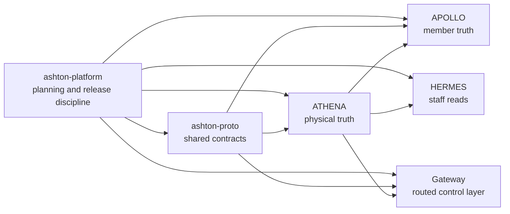
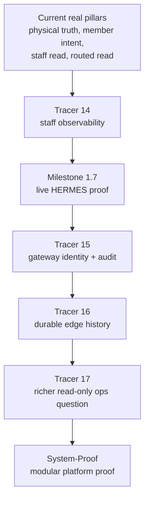

# ixxet

I build load-bearing software for real places.

Right now that work lives under **Lintel**, with the current internal platform
architecture developed under the codename **ASHTON**.

I care about:

- physical truth before product guesswork
- narrow, testable slices instead of broad hand-wavy platforms
- contract discipline across repos
- deployment proof, not just local demos
- systems that stay readable as they grow

## What I'm Building

| Project | Role | Current truth |
| --- | --- | --- |
| [`athena`](https://github.com/ixxet/athena) | physical truth service | presence, occupancy, edge ingress, identified lifecycle publish, and bounded live edge deployment |
| [`apollo`](https://github.com/ixxet/apollo) | member truth and intent | auth, profile state, explicit lobby membership, workouts, recommendations, thin shell, deterministic match preview |
| [`hermes`](https://github.com/ixxet/hermes) | staff-facing operations | one bounded read-only occupancy question over public upstream truth |
| [`ashton-mcp-gateway`](https://github.com/ixxet/ashton-mcp-gateway) | narrow control plane | first manifest-backed routed occupancy read with inspectable logs |
| [`ashton-proto`](https://github.com/ixxet/ashton-proto) | shared contracts | schemas, helpers, and wire boundaries across the stack |
| [`ashton-platform`](https://github.com/ixxet/ashton-platform) | control-plane docs and release discipline | platform source-of-truth, tracer ladder, hardening, and roadmap |
| [`Prometheus`](https://github.com/ixxet/Prometheus) | deployment and GitOps substrate | bounded live rollout proof for the slices that are actually deployed |

## Public Brand And Internal Naming

| Name | Use |
| --- | --- |
| `Lintel` | public brand |
| `LintelHQ` | org / operational handle |
| `ASHTON` | internal codename for the current platform architecture |

## How I Build

| Principle | Meaning |
| --- | --- |
| Narrow slices | one tracer proves one bounded capability and stops |
| Honest truth split | local truth, deployed truth, and deferred work stay separate |
| Read before write | routed reads and observability come before approvals and mutations |
| Modularity first | physical truth, member truth, staff truth, and control plane stay separate |
| Hardening matters | failures and destructive checks are part of the proof |

## Current Platform Shape

Standalone source: [`docs/diagrams/projects-and-boundaries.mmd`](docs/diagrams/projects-and-boundaries.mmd)

## Current Ladder

| Line | Why it matters |
| --- | --- |
| `Tracer 14` | strengthen HERMES observability without widening scope |
| `Milestone 1.7` | prove live HERMES deployment truth |
| `Tracer 15` | add gateway caller identity, persisted audit, and a second routed read |
| `Tracer 16` | add durable ATHENA edge-observation groundwork |
| `Tracer 17` | answer one richer read-only staff question from stable upstream truth |
| `System-Proof Milestone` | prove the stack as one modular, maintainable system |

Standalone source: [`docs/diagrams/lintel-ladder.mmd`](docs/diagrams/lintel-ladder.mmd)

## Why This Direction

I’m not trying to make a flashy “AI platform” page.

I’m trying to build something more durable:

- software that understands real-world state
- systems that stay narrow until they earn the right to widen
- infrastructure that becomes more trustworthy as it grows

That is the bar I want the work to clear.
